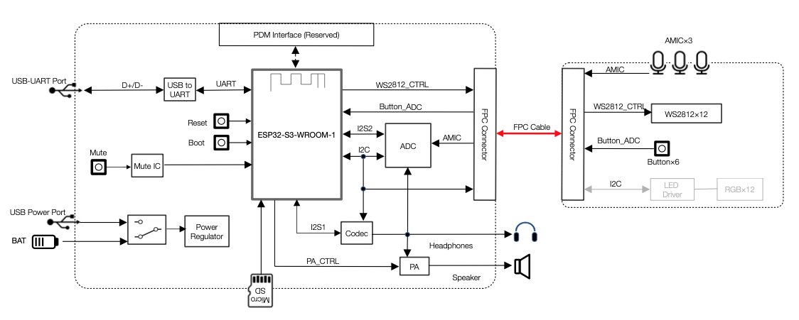
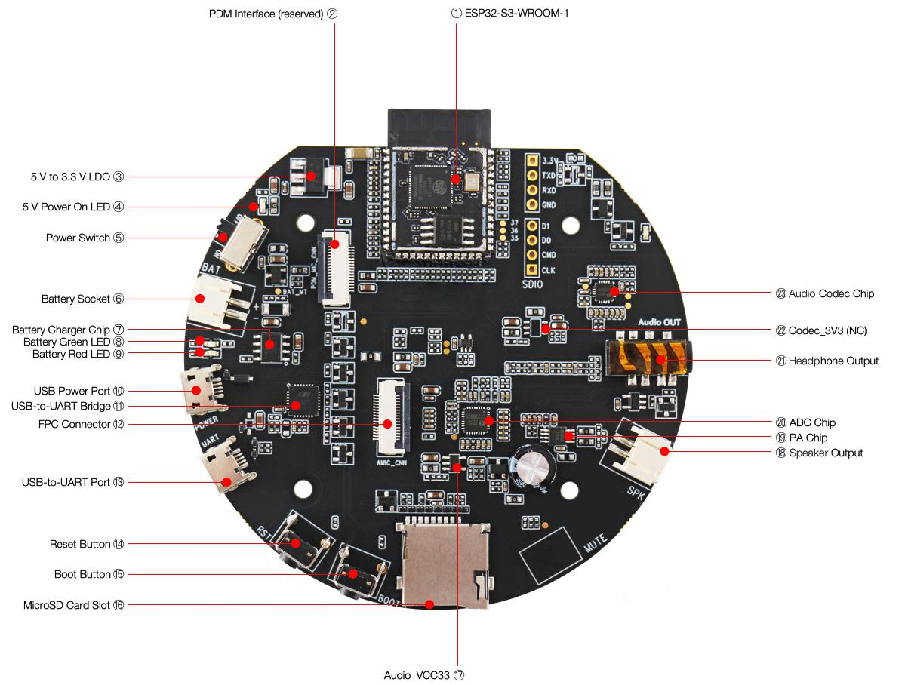
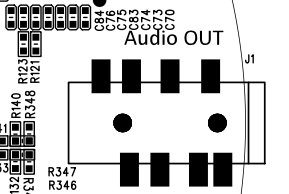

# ESP32-S3-Korvo-1 v5.0 <!-- omit in toc -->

[中文](../../../zh_CN/hw-reference/esp32s3/user-guide-korvo-1.md)

- [1. Getting Started](#1-getting-started)
  - [1.1 Overview](#11-overview)
  - [1.2 Block Diagram](#12-block-diagram)
  - [1.3 Components on the ESP32-S3-Korvo-1 Main Board](#13-components-on-the-esp32-s3-korvo-1-main-board)
  - [1.4 Components on the ESP32-Korvo-Mic Sub Board](#14-components-on-the-esp32-korvo-mic-sub-board)
  - [1.5 Contents and Packaging](#15-contents-and-packaging)
    - [1.5.1 Retail Orders](#151-retail-orders)
    - [1.5.2 Wholesale Orders](#152-wholesale-orders)
  - [1.6 Default Firmware and Function Test](#16-default-firmware-and-function-test)
- [2. Start Application Development](#2-start-application-development)
  - [2.1 Required Hardware](#21-required-hardware)
  - [2.2 Optional Hardware](#22-optional-hardware)
  - [2.3 Power Supply Options](#23-power-supply-options)
  - [2.4 Hardware Setup](#24-hardware-setup)
  - [2.5 Software Setup](#25-software-setup)
- [3. Hardware Reference](#3-hardware-reference)
  - [3.1 Notes on GPIO Allocations](#31-notes-on-gpio-allocations)
  - [3.2 Notes on Power Distribution](#32-notes-on-power-distribution)
    - [3.2.1 Power Supply over USB and from Battery](#321-power-supply-over-usb-and-from-battery)
    - [3.2.2 Independent Module and Audio Power Supply](#322-independent-module-and-audio-power-supply)
  - [3.3 Selecting of Audio Output](#33-selecting-of-audio-output)
- [4. Hardware Revision Details](#4-hardware-revision-details)
- [5. Related Documents](#5-related-documents)
  - [5.1 Datasheet](#51-datasheet)
  - [5.2 Schematic](#52-schematic)
  - [5.3 PCB Layout](#53-pcb-layout)
  - [5.4 Dimensions](#54-dimensions)

This user guide will help you get started with ESP32-S3-Korvo-1 v5.0 and will also provide more in-depth information.

> **Notice**
>
> If you use ESP32-S3-Korvo-1 v4.0, please follow this guide. The differences between v5.0 and v4.0 are described in Section [Hardware Revision Details](#4-hardware-revision-details).

The ESP32-S3-Korvo-1 is an AI development board produced by [Espressif](https://espressif.com). It is based on the [ESP32-S3](https://www.espressif.com/en/products/socs/esp32-s3) SoC and [ESP-Skainet](https://www.espressif.com/en/solutions/audio-solutions/esp-skainet/overview), Espressif’s speech recognition SDK. It features a three-microphone array which is suitable for far-field voice pick-up with low power consumption. The ESP32-S3-Korvo-1 board supports voice wake-up and offline speech command recognition in Chinese and English languages. With ESP-Skainet, you can develop a variety of speech recognition applications, such as smart displays, smart plugs, smart switches, etc.

|  | 
|:--:| 
|ESP32-S3-Korvo-1|

The document consists of the following major sections:

-   [Getting started](#1-getting-started): Introduction of the board, block diagram, description of key components, contents and packaging, as well as quick guide to use the board.
-   [Start Application Development](#2-start-application-development): Hardware and software setup instructions to flash firmware onto the board.
-   [Hardware Reference](#3-hardware-reference): More detailed information about the board's hardware.
-   [Hardware Revision Details](#4-hardware-revision-details): Hardware revision history, known issues, and links to user guides for previous versions (if any) of the board.
-   [Related Documents](#5-related-documents): Links to related documentation.

# 1. Getting Started

## 1.1 Overview

The ESP32-S3-Korvo-1 board consists of two parts: the main board (ESP32-S3-Korvo-1) that integrates the ESP32-S3-WROOM-1 module, function buttons, SD card slot, speaker and USB connectors; and the sub board (ESP32-Korvo-Mic, which is also used as the sub board in [ESP32-Korvo v1.1](https://github.com/espressif/esp-skainet/blob/master/docs/en/hw-reference/esp32/user-guide-esp32-korvo-v1.1.md)) that contains a three-microphone array, function buttons, and addressable LEDs. The main board and sub board are connected via FPC cable.

## 1.2 Block Diagram

The block diagram below presents main components of the ESP32-S3-Korvo-1 main board (on the left) and the ESP32-Korvo-Mic sub board (on the right), as well as the interconnections between components.

|  | 
|:--:| 
|ESP32-S3-Korvo-1 Block Diagram|

The following sections will describe the key components on the main board and the sub board, respectively.

## 1.3 Components on the ESP32-S3-Korvo-1 Main Board

|  | 
|:--:| 
|ESP32-S3-Korvo-1 - front|

The key components of the board are described in an anti-clockwise direction starting from the ESP32-S3-WROOM-1 module.

| No. | Key Component|       Description |
|-----|--------------------------|--|
| 1   | ESP32-S3-WROOM-1         | The ESP32-S3-WROOM-1 module embeds the ESP32-S3R8 chip variant that provides Wi-Fi and Bluetooth 5 (LE) connectivity, as well as dedicated vector instructions for accelerating neural network computing and signal processing. On top of the integrated 8 MB PSRAM offered by the SoC, the module also comes with 16 MB flash, allowing for fast data access. |
| 2   | PDM Interface (reserved) | Reserved FPC connector for connecting the sub board to use three digital microphones having a pulse-density modulated (PDM) output.|
| 3   | 5 V to 3.3 V LDO         | Power regulator that converts a 5 V supply into a 3.3 V output for the module.|
| 4   | 5 V Power On LED         | The LED (red) turns on when the USB power is connected to the board and the **Power Switch** is toggled to "ON". |
| 5   | Power Switch             | Toggling it to “ON” powers on the board; toggling it to “OFF” powers off the board. |
| 6   | Battery Socket           | Two-pin socket to connect a Li-ion battery. The battery serves as an alternative power supply to the **USB Power Port** for charging the board. Make sure to use a Li-ion battery that has protection circuit and fuse. The recommended specifications of the battery: capacity > 1000 mAh, output voltage 3.7 V, input voltage 4.2 V – 5 V. Please verify if polarity on the battery plug matches polarity of the socket as marked on the board’s soldermask besides the socket. |
| 7   | Battery Charger Chip     | 1 A linear Li-ion battery charger (AP5056), used for charging a battery connected to the **Battery Socket**. The power source for charging is the **USB Power Port**.|
| 8   | Battery Green LED        | When the USB power is connected to the board and a battery is not connected, the green LED turns on. If a battery is connected and fully charged, the green LED turns on.  |
| 9   | Battery Red LED          | When the USB power is connected to the board and a battery is not connected, the red LED blinks. If a battery is connected, the red LED turns on, indicating that the battery is being charged. When the battery is fully charged, the red LED turns off. |
| 10  | USB Power Port           | A Micro-USB port used for power supply to the board.|
| 11  | USB-to-UART Bridge       | Single USB-to-UART bridge chip provides transfer rates up to 3 Mbps. |
| 12  | FPC Connector            | Connects the main board and the sub board. |
| 13  | USB-to-UART Port         | A Micro-USB port used for communication with the chip via the on-board USB-to-UART bridge. |
| 14  | Reset Button             | Press this button to reset ESP32-S3. |
| 15  | Boot Button              | Download button. Holding down **Boot** and then pressing **Reset** initiates Firmware Download mode for downloading firmware through the serial port. |
| 16  | MicroSD Card Slot        | Used for inserting a MicroSD card to expand memory capacity. SPI mode is supported. |
| 17  | Audio_VCC33              | Power regulator that converts a 5 V supply into a 3.3 V output for the audio. |
| 18  | Speaker Output           | Output socket to connect a speaker. A 4-ohm, 3-watt speaker is recommended. The pins have a 2.00 mm / 0.08” pitch. |
| 19  | PA Chip                  | Ultra-low EMI, filterless, 3-watt mono class D audio amplifier chip. |
| 20  | ADC Chip                 | Multi-bit delta-sigma audio ADC with four channels (ES7210). It features 102 dB signal-to-noise ratio, –85 dB THD+N, 24-bit, 8 to 100 kHz sampling frequency, I2S/PCM master or slave serial data port, and supports TDM. It communicates with ESP32-S3 through I2S and I2C interface. |
| 21  | Headphone Output         | Output socket to connect headphones with a 3.5 mm stereo jack. Please note that the board outputs a mono signal. |
| 22  | Codec_3V3 (NC)           | Alternative power supply to the Codec chip. It is not connected or used by default. |
| 23  | Audio Codec Chip         | The audio codec chip, [ES8311](http://www.everest-semi.com/pdf/ES8311%20PB.pdf), is a low power mono audio codec. It consists of 1-channel ADC, 1-channel DAC, low noise pre-amplifier, headphone driver, digital sound effects, analog mixing and gain functions. It is interfaced with the **ESP32-S3-WROOM-1** module over I2S and I2C buses to provide audio processing in hardware independently from the audio application. |

## 1.4 Components on the ESP32-Korvo-Mic Sub Board

|  | 
|:--:| 
|ESP32-Korvo-Mic - front|

|  | 
|:--:| 
|ESP32-Korvo-Mic - back|

The key components of the board are described from front to back.

| Key Component      | Description |
|--------------------|----|
| Analog Microphone  | Three analog microphones form an array (spacing = 65 mm). An array of two analog microphones with spacing of 55 mm is also possible (not populated by default) in hardware, but not yet supported by software. |
| RGB LED            | Twelve addressable RGB LEDs (WS2812C). |
| Function Button    | There are six function buttons on the board. Users can configure any functions as needed. |
| Digital Microphone | Hardware supports three digital microphones to form an array (spacing = 65 mm), which is not populated by default. This option is not yet supported by software.          |
| FPC Connector      | Connects the main board and the sub board.             |

## 1.5 Contents and Packaging

### 1.5.1 Retail Orders

If you order a few samples, each board comes in an individual package in either antistatic bag or any packaging depending on your retailer. Each package contains:

-   1 x ESP32-S3-Korvo-1 main board
-   1 x ESP32-Korvo-Mic sub board
-   1 x FPC cable
-   8 x screws
-   4 x studs

These components are assembled by default.

For retail orders, please go to <https://www.espressif.com/en/company/contact/buy-a-sample>.

### 1.5.2 Wholesale Orders

If you order in bulk, the boards come in large cardboard boxes.

For wholesale orders, please go to <https://www.espressif.com/en/contact-us/sales-questions>.

## 1.6 Default Firmware and Function Test

Each ESP32-S3-Korvo-1 board comes with pre-built [default firmware](https://github.com/espressif/esp-skainet/blob/master/tools/default_firmware/default_firmware_ESP32-S3-Korvo-1) that allows you to test its functions including voice wake-up and speech command recognition.

> **Notice**
>
> Please note that only Chinese wake word and Chinese speech commands are supported in the default firmware. You can also configure to use English wake words and speech commands in [esp-skainet/examples](https://github.com/espressif/esp-skainet/tree/master/examples). To do so, please first follow the steps in [Section 2](#2-start-application-development).

To test the board's functions, you need the following hardware:

-   1 x ESP32-S3-Korvo-1
-   1 x USB 2.0 cable (Standard-A to Micro-B), for USB power supply

Before powering up your board, please make sure that it is in good condition with no obvious signs of damage. Both the main board and the sub board should be firmly connected together. Then, follow the instructions described below:

1.  Connect the board to a power supply through the **USB Power Port** using a USB cable. The **Battery Green LED** should turn on. Assuming that a battery is not connected, the **Battery Red LED** will blink.
2.  Toggle the **Power Switch** to **ON**. The red **5 V Power On LED** should turn on.
3.  Press the **Reset Button** on the main board.
4.  Activate the board with the default Chinese wake word “Hi 乐鑫” (meaning "Hi Espressif"). When the wake word is detected, the 12 RGB LEDs on the sub board glow white one by one, indicating that the board is waiting for a speech command.
5.  Say a command to control your board. The table below provides a list of default Chinese speech commands.

| Default Chinese Speech Commands | Meaning                  | Response             |
|---------------------------------|--------------------------|----------------------|
| 关闭电灯                        | Turn off the light       | RGB LEDs go out      |
| 打开白色灯                      | Turn on the white light  | RGB LEDs glow white  |
| 打开红色灯                      | Turn on the red light    | RGB LEDs glow red    |
| 打开绿色灯                      | Turn on the green light  | RGB LEDs glow green  |
| 打开蓝色灯                      | Turn on the blue light   | RGB LEDs glow blue   |
| 打开黄色灯                      | Turn on the yellow light | RGB LEDs glow yellow |
| 打开青色灯                      | Turn on the cyan light   | RGB LEDs glow cyan   |
| 打开紫色灯                      | Turn on the purple light | RGB LEDs glow purple |

If the command is not recognized, RGB LEDs return to the state before voice wake-up.

Now you get the first experience with the board. The following sections provide further information about how to flash firmware onto the board, configuration options, related resources, and more.

# 2. Start Application Development

This section provides instructions on how to do hardware/software setup and flash firmware onto the board for application development.

## 2.1 Required Hardware

-   1 x ESP32-S3-Korvo-1
-   2 x USB 2.0 cables (Standard-A to Micro-B), one for USB power supply, the other for flashing firmware on to the board
-   4-ohm, 3-watt speaker or headphones with a 3.5 mm jack. If you use a speaker, it is recommended to choose one no more than 3 watts and fitted with JST PH 2.0 2-Pin plugs are needed. In case you do not have this type of plug it is also fine to use Dupont female jumper wires during development.
-   Computer running Windows, Linux, or macOS

## 2.2 Optional Hardware

-   1 x MicroSD card
-   1 x Li-ion battery

> **Notice**
>
> Be sure to use a Li-ion battery that has built-in protection circuit.

## 2.3 Power Supply Options

There are two ways to provide power to the board:

-   USB Power Port
-   External battery via the 2-pin battery connector

## 2.4 Hardware Setup

Prepare the board for loading of the first sample application:

1.  Connect the board to a power supply through the **USB Power Port** using a USB cable. The **Battery Green LED** should turn on. Assuming that a battery is not connected, the **Battery Red LED** will blink.
2.  Toggle the **Power Switch** to **ON**. The red **5 V Power On LED** should turn on.
3.  Connect the board with the computer through the **USB-to-UART Port** using a USB cable.
4.  Connect a speaker to the **Speaker Output**, or connect headphones to the **Headphone Output**.

Now the board is ready for software setup.

## 2.5 Software Setup

After hardware setup, you can proceed with preparation of development tools. Go to the [guide to ESP-Skainet](https://github.com/espressif/esp-skainet/blob/master/README.md) --\> Section [Software Preparation](https://github.com/espressif/esp-skainet/blob/master/README.md#software-preparation), which will walk you through the following steps:

1.  [Get ESP-Skainet](https://github.com/espressif/esp-skainet/blob/master/README.md#esp-skainet) to run Espressif's voice assistant. In ESP-Skainet, you may use [ESP-SR](https://github.com/espressif/esp-sr/blob/master/README.md) to call APIs for specific applications, including wake word detection, speech command recognition, and acoustic algorithm.
2.  [Set up ESP-IDF](https://github.com/espressif/esp-skainet/blob/master/README.md#esp-idf) which provides a common framework to develop applications for ESP32-S3 in C language.
3.  [Build, flash and run ESP-Skainet examples](https://github.com/espressif/esp-skainet/blob/master/README.md#examples).

> **Note**
>
> Espressif provides the **Off-line Wake Word Customization** service which allows you to customize wake words. For the detailed process, please refer to [Espressif Speech Wake Word Customization Process](https://github.com/espressif/esp-sr/blob/master/docs/wake_word_engine/ESP_Wake_Words_Customization.md).

# 3. Hardware Reference

This section provides more detailed information about the board's hardware.

## 3.1 Notes on GPIO Allocations

All GPIOs of the **ESP32-S3-WROOM-1 Module** have already been used to control specific components or functions of the board. If you would like to configure any pins yourself, please refer to the schematics provided in Section [Related Documents](#5-related-documents).

## 3.2 Notes on Power Distribution

### 3.2.1 Power Supply over USB and from Battery

The main power supply is 5 V and provided over a USB. The secondary power supply is 4.2 V and provided by an optional battery. To further reduce noise from the USB, the battery may be used instead of the USB.

|| 
|:--:| 
|ESP32-S3-Korvo-1 - Dedicated USB Power Supply Socket|

|| 
|:--:| 
|ESP32-S3-Korvo-1 - Power Supply from a Battery|

### 3.2.2 Independent Module and Audio Power Supply

The ESP32-S3-Korvo-1 board features independent power supplies to the audio components and the ESP32-S3-WROOM-1 module. This should reduce noise in the audio signal from module components and improve overall performance of the components.

|| 
|:--:| 
|ESP32-S3-Korvo-1 - Module Power Supply|

|| 
|:--:| 
|ESP32-S3-Korvo-1 - Audio Power Supply|

## 3.3 Selecting of Audio Output

The board provides two mutually exclusive audio outputs:

1.  Speaker output: The speaker output is enabled if headphones are not plugged in.
2.  Headphone output: Once headphones are plugged in, speaker output is disabled and headphone output is enabled.

# 4. Hardware Revision Details

Compared to ESP32-S3-Korvo-1 v4.0, ESP32-S3-Korvo-1 v5.0 has two changes in hardware: 1) marking on the main board，2) location of J1 on the main board. The changes are described in detail below:

1.  Marking on the (back of) main board: ESP32-S3-Korvo-1 v5.0 has marking "ESP32-S3-Korvo-1 V5.0" on the main board, while ESP32-S3-Korvo-1 v4.0 has marking "ESP32-S3-Korvo V4.0" on the main board.

| ESP32-S3-Korvo-1 V5.0 Marking      | ESP32-S3-Korvo V4.0 Marking |
|--------------------|----|
|   | |

2.  The J1 component on the ESP32-S3-Korvo-1 v5.0 main board is moved a little to the right. This does not affect the performance of the board.

| J1 Location on the ESP32-S3-Korvo-1 v5.0 Main Board    |  J1 Location on the ESP32-S3-Korvo-1 v4.0 Main Board  |
|--------------------|----|
|   | |

3.  The **main board schematics**, **main board PCB layout diagrams**, **main board dimension diagrams**, **main board dimension source files** are updated because of the two hardware changes. (See [Related Documents](#5-related-documents)).

# 5. Related Documents

## 5.1 Datasheet

-   [ESP32-S3 Datasheet](https://www.espressif.com/sites/default/files/documentation/esp32-s3_datasheet_en.pdf) (PDF)
-   [ESP32-S3-WROOM-1 & ESP32-S3-WROOM-1U Datasheet](https://www.espressif.com/sites/default/files/documentation/esp32-s3-wroom-1_wroom-1u_datasheet_en.pdf) (PDF)

## 5.2 Schematic

-   [ESP32-S3-Korvo-1 v5.0 Main Board Schematic](https://dl.espressif.com/dl/schematics/SCH_ESP32-S3-Korvo-1_V6_20211201.pdf) (PDF)
-   [ESP32-S3-Korvo-1 v4.0 Main Board Schematic](https://dl.espressif.com/dl/schematics/sch_esp32-s3-korvo_v5_20211020.pdf) (PDF)
-   [ESP32-Korvo-Mic Sub Board Schematic](https://dl.espressif.com/dl/schematics/SCH_ESP32-KORVO-MIC_V1_1_20200316A.pdf) (PDF)

## 5.3 PCB Layout

-   [ESP32-S3-Korvo-1 v5.0 Main Board PCB Layout](https://dl.espressif.com/dl/schematics/PCB_ESP32-S3-Korvo-1_V5_20211201.pdf) (PDF)
-   [ESP32-S3-Korvo-1 v4.0 Main Board PCB Layout](https://dl.espressif.com/dl/schematics/PCB_ESP32-S3-KORVO_V4_20210719AE.pdf) (PDF)
-   [ESP32-Korvo-Mic PCB layout](https://dl.espressif.com/dl/schematics/PCB_ESP32-Korvo-Mic_V1_1_20200316AA.pdf) (PDF)

## 5.4 Dimensions

-   [ESP32-S3-Korvo-1 v5.0 Main Board Dimensions](https://dl.espressif.com/dl/schematics/DXF_ESP32-S3-Korvo-1_V5_mb_20211207.pdf) (PDF)
-   [ESP32-S3-Korvo-1 v4.0 Main Board Dimensions](https://dl.espressif.com/dl/schematics/DXF_ESP32-S3-KORVO_V4_MB_20210719AE.pdf) (PDF)
-   [ESP32-Korvo-Mic Sub Board Front Dimensions](https://dl.espressif.com/dl/schematics/DXF_ESP32-S3-Korvo-Mic_top_V1_1_20211111.pdf) (PDF)
-   [ESP32-Korvo-Mic Sub Board Back Dimensions](https://dl.espressif.com/dl/schematics/DXF_ESP32-S3-Korvo-Mic_Bottom_V1_1_20211111.pdf) (PDF)
-   [ESP32-S3-Korvo-1 v5.0 Main Board Dimensions Source File](https://dl.espressif.com/dl/schematics/DXF_ESP32-S3-Korvo-1_V5_mb_20211207.dxf) (DXF) - You can view it with [Autodesk Viewer](https://viewer.autodesk.com/) online
-   [ESP32-S3-Korvo-1 v4.0 Main Board Dimensions Source File](https://dl.espressif.com/dl/schematics/DXF_ESP32-S3-KORVO_V4_MB_20210719AE.dxf) (DXF) - You can view it with [Autodesk Viewer](https://viewer.autodesk.com/) online
-   [ESP32-Korvo-Mic Sub Board Front Dimensions Source File](https://dl.espressif.com/dl/schematics/DXF_ESP32-S3-Korvo-Mic_top_V1_1_20211111.dxf) (DXF) - You can view it with [Autodesk Viewer](https://viewer.autodesk.com/) online
-   [ESP32-Korvo-Mic Sub Board Back Dimensions Source File](https://dl.espressif.com/dl/schematics/DXF_ESP32-S3-Korvo-Mic_Bottom_V1_1_20211111.dxf) (DXF) - You can view it with [Autodesk Viewer](https://viewer.autodesk.com/) online

For further design documentation for the board, please contact us at [<sales@espressif.com>](sales@espressif.com).
